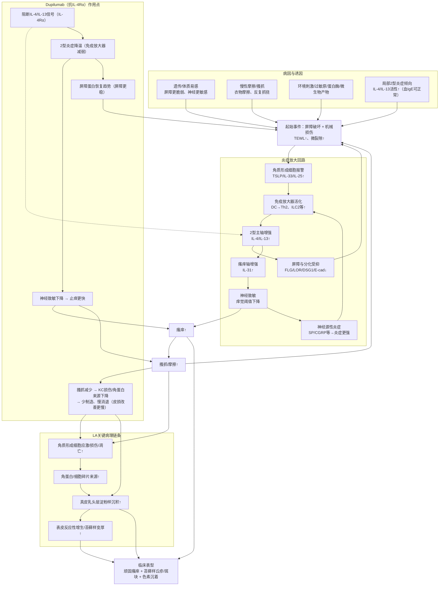

```mermaid
flowchart TB;

subgraph E[病因与诱因];
  A1["遗传/体质易感<br/>屏障更脆弱、神经更敏感"];
  A2["慢性摩擦/搔抓<br/>衣物摩擦、反复抓挠"];
  A3["环境刺激/过敏原/蛋白酶/微生物产物"];
  A4["局部2型炎症倾向<br/>IL-4/IL-13活性↑（血IgE可正常）"];
end;

B["起始事件：屏障破坏 + 机械损伤<br/>TEWL↑、微裂隙↑"];

A1 --> B;
A2 --> B;
A3 --> B;
A4 --> B;

subgraph AMP[炎症放大回路];
  C1["角质形成细胞报警<br/>TSLP/IL-33/IL-25↑"];
  C2["免疫放大器活化<br/>DC→Th2、ILC2等↑"];
  C3["2型主轴增强<br/>IL-4/IL-13↑"];
  C4["屏障与分化受抑<br/>FLG/LOR/DSG1/E-cad↓"];
  C5["瘙痒轴增强<br/>IL-31↑"];
  C6["神经致敏<br/>痒觉阈值下降"];
  C7["神经源性炎症<br/>SP/CGRP等→炎症更强"];
end;

B --> C1;
C1 --> C2;
C2 --> C3;
C3 --> C4;
C4 --> B;

C3 --> C5;
C5 --> C6;

C6 --> ITCH["瘙痒↑"];
ITCH --> SCR["搔抓/摩擦↑"];
SCR --> B;

C6 --> C7;
C7 --> C2;

subgraph P[LA关键病理链条];
  F1["角质形成细胞应激/损伤/凋亡↑"];
  F2["角蛋白/细胞碎片来源↑"];
  F3["真皮乳头层淀粉样沉积↑"];
  F4["表皮反应性增生/苔藓样变厚↑"];
end;

SCR --> F1;
F1 --> F2;
F2 --> F3;
F3 --> F4;

G["临床表型<br/>顽固瘙痒 + 苔藓样丘疹/斑块 + 色素沉着"];
ITCH --> G;
F4 --> G;
F3 --> G;

subgraph H[Dupilumab（抗IL-4Rα）作用点];
  H1["阻断IL-4/IL-13信号（IL-4Rα）"];
  H2["2型炎症降温（免疫放大器减弱）"];
  H3["神经致敏下降 → 止痒更快"];
  H4["屏障蛋白恢复趋势（屏障更稳）"];
  H5["搔抓减少 → KC损伤/角蛋白来源下降<br/>→ 少制造、慢消退（皮损改善更慢）"];
end;

H1 -.-> C3;
H1 --> H2;
H2 --> H3;
H2 --> H4;

H3 --> ITCH;
H4 --> B;

H3 --> SCR;
SCR --> H5;
H5 --> F1;
H5 --> F3;
```
